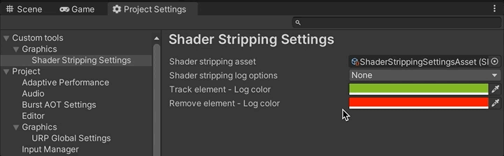

# ShaderStrippingTester
This project was made with the purpose of testing the [com.v3gs.shaderstrippinghelper](https://github.com/V3GS/com.v3gs.shaderstrippinghelper) package.

##### Unity version: 2021.3.19f1
<br/>

**Project running in Unity Editor**

## Strip out Shader keywords and shaders by name

This is a simple scene that only contains a couple of Utah Teapots. Each GameObject has associated a shader that has enabled a specific keyword, in this case, the RED and BLUE keyword.

The shader looks like this (you can check the [full implementation here](Assets/Shaders/CustomUnlitTest.shader)):


```C
Shader "Custom/UnlitTest"
{
    // ...
    SubShader
    {
        // ...
        Pass
        {
            HLSLPROGRAM
            #pragma vertex vert
            #pragma fragment frag

            #pragma multi_compile RED BLUE

            // ...

            half4 frag() : SV_Target
            {
                #if defined(RED)
                    return half4(1, 0, 0, 1);
                #elif defined(BLUE)
                    return half4(0, 0, 1, 1);
                #endif
            }
            ENDHLSL
        }
    }
}
```

**Unity Editor**

So, in Unity's Scene and Game view you can observe the following result:


**Player**

Due to in this test project the _ShaderStrippingSettingsAsset_ is set up to strip out the RED and BLUE keywords, and aditionally, it also strip out the shader *Skybox/Procedural*.


You will obtain the following result in the player build:


## How to generate a build report?
For generating a build report you need to enable the _Generate Shader Stripping Report_ option in the _ShaderStrippingSettingsAsset_.
Additionally, you can configure the path where you want the report is located at and the file name of the current report.


## How to generate a Shader Variant Collection file?
Likewise, you can specify if you require a Shader Variant Collection from the current build, its name, and where will be located at by modifying the _ShaderStrippingSettingsAsset_.


## How to avoid overriding the latest build report and ShaderVariantCollection files?
If you want to preverse your Shader variant build reports and their respectives Shader Variant Collections, you can avoid overriding the latest generated files by enabling the _Use data time for naming files_ option.


## How to log those keywords and shaders that are being strip out?
Another feature that might be interested to enable, it's logging information about the shaders and shader keywords that are being strip out.

You can tweak this option by opening the Project settings window, and navigate to the _Custom tools > Graphics > Shader Stripping Settings_.

In there, you can specify if you want to log the information of shaders/keywords removed or/and tracking if those values are being treated by the IPreprocessShaders interface.



When you generate your builds, you will observe something like this:


# Resources
 * [Utah Teapot PBR](https://skfb.ly/otAPM) by hackmans.